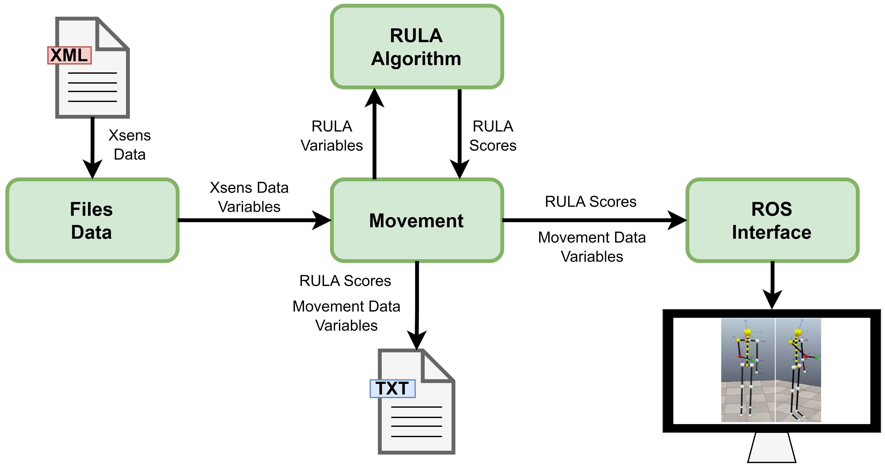
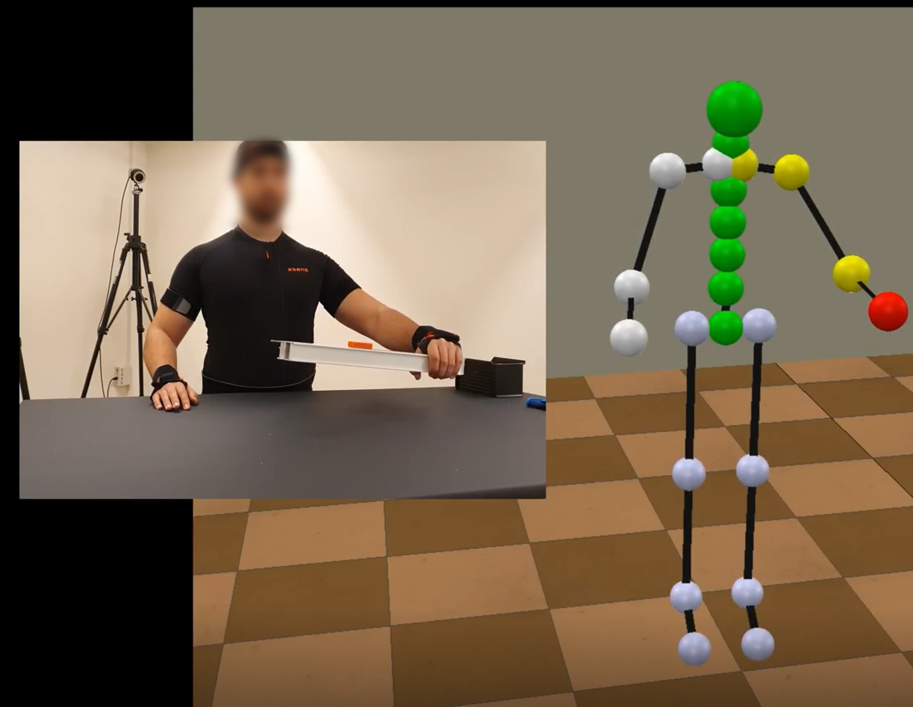

# RULA-Based-Postural-Assessment

Software for postural assessment based on the RULA method from motion data captured using XSens System. This model was developed in C++ using the Qt IDE.

## Pre Requisites 
- Operating System: Linux (Ubuntu 18/20)
- ROS
- CoppelliaSim
- QtCreator

## Installation

- Create a ROS workspace in the home directory and place the downloaded src folder inside it.
- Open a terminal and execute: $catkin_make.
- Create a ROS project in QtCreator and set the newly created ROS workspace as the project workspace.

## Execution

- Launch CoppeliaSim and open the scenario joints_model.ttt.
- In the ROS workspace, open a terminal and execute the following:
    - $ source devel/setup.bash
    - $ rosrun rula rula /home/{USER}/RULA_Assessment_Software/src/rula/xml_files/{FILE_NAME}.xml

Replace {USER} with the corresponding username and {FILE_NAME} with the desired XML file.
An example file, Sample.xml, is available in the xml_files directory.

---

## System Overview

* Motion capture performed with the **Xsens system**, which uses inertial sensors placed at key body points.
* Xsens data is stored in **MVNX (MVN Open XML)** files.
* The software processes this data to extract movement variables and compute **RULA** (Rapid Upper Limb Assessment) scores.
* Posture analysis and evaluation are performed frame by frame.
* Movements can be replicated in **CoppeliaSim** through a human avatar, with posture evaluations displayed using a color code.
* Communication with CoppeliaSim is handled via **ROS**.
* A report file is generated containing, for each frame:

  * RULA scores per body segment
  * Overall RULA score
  * Hand position relative to the evaluated arm

## Architecture

The software is divided into different modules:

* **Files Data**: Reads and stores Xsens MVNX files.
* **Data Movement**: Defines motion variables (segment positions/orientations, joint Euler angles) and computes RULA variables.
* **RULA**: Performs posture assessment and stores scores for each frame.
* **ROS Communication**: Manages communication with CoppeliaSim, defining topics, message types, and publishing functions.

  

---

## Data Processing

The first stage of the software consists of reading motion data stored in **MVNX (MVN Open XML)** files generated by the Xsens system. For each frame of motion, the following data are extracted:

* **Body segments:** 23 segments with position and orientation relative to a ground-based reference frame.
* **Joints:** 28 joints in total, including 6 ergonomic joints.
* **Euler angles:** Joint angles represented in both `JointAngleXYZ` and `JointAngleErgo` formats.

The software filters these data to retain only the variables relevant for posture assessment. For each frame, the following objects are created and stored in buffers:

* 23 objects of type *position*
* 23 objects of type *orientation*
* 22 objects of type *joint\_angle\_ZYX*
* 6 objects of type *ergonomic\_joint\_angle\_ZYX*

These objects contain the segment or joint name, Cartesian position/orientation or Euler angle values (x, y, z). As frames are processed sequentially, the data are aggregated into two-dimensional buffers that organize the information by frame and by body segment/joint.

This structured data is then used for posture evaluation through the RULA algorithm and for simulation in **CoppeliaSim**.

---

## RULA Variables

The Xsens system provides the necessary joint data to compute these factors. The developed software maps the **RULA factors** for each body segment to the corresponding **movement variables**, including:

* Variable type
* Associated joint name
* Euler angle components (x, y, z)

### RULA Factors Mapping

| Body Segment | Variable Type                | Joint Name                           | Euler Component (ZXY) | RULA Factor                              |
| ------------ | ---------------------------- | ------------------------------------ | --------------------- | ---------------------------------------- |
| Arm          | ergonomic\_joint\_angle\_ZXY | T8\_RightUpperArm / T8\_LeftUpperArm | Y / Z                 | Flexion / Abduction                      |
| Forearm      | joint\_angle\_ZXY            | JRightElbow / JLeftElbow             | Y / Z                 | Flexion / Midline exceeded               |
| Wrist        | joint\_angle\_ZXY            | JRightWrist / JLeftWrist             | Y / Z / X             | Flexion / Wrist midline exceeded / Pronation         |
| Neck         | joint\_angle\_ZXY            | JC1Head                              | Y / Z / X             | Flexion / Lateral inclination / Rotation |
| Trunk        | joint\_angle\_ZXY            | Vertical\_T8                         | Y / Z / X             | Flexion / Lateral inclination | Rotation |

This mapping allows the software to automatically extract the ergonomic evaluation factors directly from the captured motion data.

---

## Simulation

* Motion data and RULA evaluations are visualized in **CoppeliaSim** using a human avatar.
* Frame-by-frame posture evaluations are shown with a **color-coded system**.

  

Video Demonstration: https://youtu.be/7bvG_mL56Jw

---

